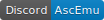

<html lang="en">
 <head>
  <!-- Required meta tags -->
  <meta name="viewport" content="width=device-width, initial-scale=1, shrink-to-fit=no">
  <meta charset="utf-8">
  <title>AscEmu</title>
  <meta name="description" content="AscEmu Official">
  <link href="assets/images/favicon.png" rel="shortcut icon"/>
  <meta name="AscEmu" content="AE">
  <!-- AE CSS -->
  <link rel="stylesheet" href="assets/css/bootstrap.min.css">
 </head>
 <body>
 <!-- navbar -->
 <nav class="navbar navbar-expand-lg navbar-dark bg-dark">
   <button class="navbar-toggler" type="button" data-toggle="collapse" data-target="#navAE" aria-controls="navAE" aria-expanded="false" aria-label="Toggle navigation">
    
   <a class="navbar-brand page-scroll" href="#page-top"><a class="nav-link" href="">AscEmu</a>  <!-- </a> -->
   </button>
   

    <ul class="navbar-nav mr-auto mt-2 mt-lg-0">
      <li class="nav-item active">
        <a class="nav-link" href="">Home</a>
      </li>
      <li class="nav-item active">
        <a class="nav-link" href="https://ascemu.github.io/Wiki/">Wiki</a>
      </li>
      <li class="nav-item active">
        <a class="nav-link" href="http://board.ascemu.org/">Forum</a>
      </li>
      <li class="nav-item active">
        <a class="nav-link" href="https://discordapp.com/invite/CBdgrh7/">Discord</a>
      </li>
      <li class="nav-item dropdown">
      <a class="nav-link dropdown-toggle" data-toggle="dropdown" href="#" role="button" aria-haspopup="true" aria-expanded="false">Other links</a>
      

        <a class="dropdown-item" href="https://github.com/AscEmu/AscEmu">Source Core repository</a>
        <a class="dropdown-item" href="https://github.com/AscEmu/OneDB">Source DB repository</a>
        <a class="dropdown-item" href="https://github.com/AscEmu/AEweb">Source AEweb repository</a>
        <a class="dropdown-item" href="https://www.openhub.net/p/AscEmu">AE on OpenHub</a>
        

        <a class="dropdown-item" href="https://github.com/AscEmu/AddOns">Source AddOns repository</a>
      

    </li>
    </ul>
  

  <!-- Fork --> 
  <header class="inner">
    <a id="forkme_banner" href="https://github.com/AscEmu/AscEmu">Fork AE on GitHub</a>
  </header>
 </nav>
 

 <!-- content -->     
 <h1 class="display-10">Welcome to AscEmu! </h1>    
 
AscEmu is an independent MMORPG server framework. The goal of the project is to provide a solid foundation for users to build on whilst also providing control over most aspects of the game.

 <!-- img -->    
 
 
 
 
 
 <!-- content -->
 

 
AscEmu is a new emulator based mainly on community involvement, and a hard working team.  
  Everyone is free to download the source code and make their own server to their own liking.  
  Sign up to our forums today, and experience AscEmu for yourself. 
  If you need any help in setting up our software, feel free to check the wiki, or ask on the forums, there are of people who will be glad to help you. 

 <a class="btn btn-primary btn-lg" href="http://board.ascemu.org/index.php/Board/7-News/" role="button">Learn more</a>
 
 

<!-- card1 -->

 

  

  <a class="twitter-timeline" href="https://twitter.com/AscEmu?ref_src=twsrc%5Etfw">Tweets by AscEmu (AE)</a> 
 

 

<!-- card2 -->
 

 

 
<iframe src="https://discordapp.com/widget?id=227808274488098819&theme=light" width="450" height="400" allowtransparency="true" frameborder="0"></iframe>

 

 

  <!-- Optional JavaScript -->
  <!-- jQuery first, then Popper.js, then Bootstrap JS -->
  
  
  
 </body>
</html>
